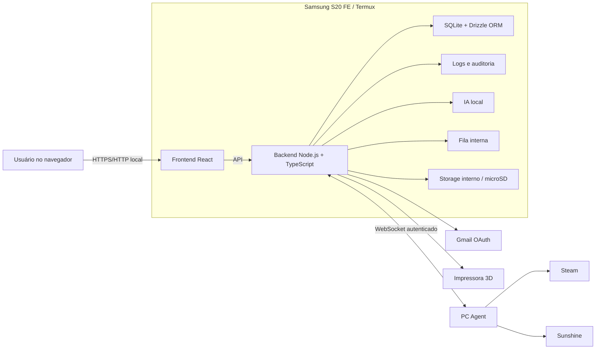

# Arquitetura

## Visão geral

O sistema segue uma arquitetura modular e local. O S20 FE hospeda o núcleo da aplicação; navegadores acessam o frontend; o PC Agent fornece somente capacidades autorizadas; integrações externas são encapsuladas por adaptadores; e a IA utiliza ferramentas controladas pelo backend.



## Responsabilidades dos componentes

### Frontend React

Em produção, o Vite gera `apps/web/dist` e não permanece em execução. O Express entrega esses arquivos estáticos junto da API, reduzindo a operação no S20 FE a uma porta e um processo Node.js.

- Dashboard e status do servidor.
- Central de logs e observabilidade em `/logs`, com consulta separada aos eventos SQLite e aos logs operacionais JSONL.
- Interface de consulta ao assistente.
- Telas de storage, PC, jogos, Sunshine e impressora.
- Apresentação de texto e dados estruturados.

O frontend nunca é uma fronteira de autorização. Toda permissão é revalidada pelo backend.

A página de logs envia filtros validados aos dois contratos públicos, mostra as fontes em seções distintas e expõe apenas os detalhes que já chegaram sanitizados pelo backend. Estados de carregamento, vazio, indisponibilidade e falha de API permanecem explícitos para não confundir ausência de eventos com falta de conectividade.

Enquanto a quantidade de serviços é pequena, o filtro de serviço permanece como texto e a interface apresenta as opções atuais em ajuda contextual. Um dropdown só deve ser introduzido quando houver um catálogo confiável de serviços observados, evitando valores rígidos que fiquem desatualizados.

### Backend Node.js e TypeScript

- API e contratos do sistema.
- Autenticação e autorização.
- Validação de entrada.
- Orquestração de módulos e integrações.
- Registro de ferramentas da IA.
- Logging, auditoria e correlação.
- Acesso controlado ao banco e armazenamento.
- Gerenciamento das conexões WebSocket.
- Recepção de webhooks e enfileiramento de operações demoradas.

### Operação no Android

O Termux:Boot inicia um supervisor em shell após a reinicialização. Ele mantém um `wake-lock`, inicia o processo Node.js, registra PIDs em `var/run/` e aplica espera progressiva antes de reiniciar o processo em caso de queda. Arquivos de log e estado dessa operação permanecem em `var/`, fora do repositório e do banco.

### Logging operacional

O backend produz eventos JSON estruturados por um serviço único, após sanitização central. Cada resposta HTTP registra nível, serviço, ação, resultado, duração, código de status e o mesmo `requestId` retornado ao cliente; erros recebem mensagem pública e código estável, sem stack trace ou conteúdo da requisição.

Os eventos operacionais são gravados em `var/log/operational.jsonl` por padrão. A configuração inicial gira o arquivo ao atingir 5 MiB e retém no máximo sete arquivos, incluindo o ativo. Diretório, limite e quantidade podem ser reduzidos por ambiente por meio de `LOG_DIRECTORY`, `LOG_MAX_BYTES` e `LOG_MAX_FILES`. Uma falha de telemetria é reportada de forma mínima no stderr e não interrompe a requisição.

A sanitização remove campos associados a senhas, tokens, segredos, autenticação, cookies, sessões e conteúdo privado, além de limitar profundidade, quantidade de itens e tamanho de texto. Os contratos públicos permanecem em `packages/contracts`; escrita, rotação e sanitização são responsabilidades internas do backend.

Eventos de auditoria e logs de nível `error` também seguem para tabelas separadas no SQLite. A auditoria guarda somente ator, ação, tipo e identificador mínimo do recurso, permissão, resultado e identificadores de rastreio; erros guardam serviço, ação, código, mensagem pública, duração e contexto sanitizado. Eventos `debug`, `info` e `warn` não são duplicados no banco. Falhas nessa persistência são isoladas do registro JSONL e da requisição principal.

As consultas persistidas seguem uma fronteira explícita: a rota Express valida a entrada com Zod e chama o caso de uso `ListPersistedEvents`; ele depende apenas da porta `PersistedEventRepository`; o adaptador `DrizzleEventRepository` traduz filtros, cursor e retenção para SQLite. A porta não expõe SQL, Drizzle ou CRUD genérico, permitindo substituir o adaptador sem alterar contratos HTTP ou casos de uso. Entidades internas usam `Date`; DTOs públicos usam timestamps ISO e união discriminada entre `audit` e `error`.

A leitura dos logs operacionais usa a porta independente `OperationalLogReader` e o adaptador `JsonlOperationalLogReader`. Ele percorre somente os nomes de arquivos rotativos conhecidos, do ativo aos arquivos mais antigos, em blocos reversos e com teto configurável de bytes. Cada linha é novamente sanitizada e validada antes da resposta. A rota retorna os registros mais recentes e informa `truncated` quando o limite de resultados ou de leitura impede afirmar que a busca está completa. Ela não usa cursor, pois uma rotação pode tornar offsets de arquivo inconsistentes entre duas requisições.

### Monitoramento do aparelho

O endpoint `GET /api/monitoring/metrics` coleta dados somente quando é chamado; não há processo residente nem histórico nesta primeira fatia. O coletor interno lê memória e swap pelo comando fixo `free -k`, capacidade do filesystem do processo e zonas térmicas legíveis de `/sys/class/thermal`. Nenhuma parte da requisição controla comandos ou caminhos. Cada medida é uma união discriminada de disponível ou indisponível, para que ausência de uma fonte não derrube a resposta inteira. O dashboard mostra uptime do processo, memória, swap, armazenamento e temperaturas com estados explícitos de carregamento, indisponibilidade de rede e falha da API.

A temperatura da bateria é lida da zona térmica quando o Android a expõe. Percentual, estado de carga, saúde e corrente permanecem fora do escopo até uma decisão explícita de instalar e configurar o complemento Termux:API; esses dados não são necessários para a disponibilidade das demais métricas.

### Storage service

O endpoint `GET /api/storage/locations` não recebe caminhos do navegador. Nesta primeira fatia ele conhece somente a raiz interna `STORAGE_ROOT`, cujo padrão é `./data/storage` no armazenamento privado do Termux. O backend cria essa raiz gerenciada quando necessário e consulta seu filesystem para retornar capacidade total, usada e disponível. Falha de criação ou leitura torna apenas essa localização indisponível; não expõe caminhos absolutos, não inventaria arquivos e não permite acessar outras áreas do aparelho. MicroSD e inventário de conteúdo permanecem fora desta fatia.

O inventário complementar `GET /api/storage/internal/items` também usa somente essa raiz fixa. Ele lista no máximo 100 entradas diretas, ordenadas por nome, com nome, tipo, tamanho e data de modificação; não recebe caminho, não percorre subdiretórios, não lê conteúdo e identifica links simbólicos sem segui-los.

O microSD não está instalado no aparelho atual e não participa do runtime. Quando estiver disponível, será adicionado como uma segunda raiz autorizada após validação explícita de montagem, capacidade e inventário; o banco SQLite ativo continuará exclusivamente no armazenamento interno do Termux.

### SQLite

Armazena configurações não secretas, metadados, estados, histórico necessário e referências de auditoria. O backend é o único proprietário do arquivo e usa Drizzle ORM com o driver nativo `node:sqlite` como camada de acesso. Tokens e segredos exigem armazenamento protegido e não devem ser tratados como dados comuns.

O banco opera em WAL para permitir leitores simultâneos durante uma escrita. Como existe apenas um escritor por vez, transações devem durar poucos milissegundos e nenhuma operação de rede ou IA pode ocorrer dentro delas. A configuração inicial inclui chaves estrangeiras, `busy_timeout=5000` e `synchronous=NORMAL`.

As migrations versionadas são aplicadas na abertura controlada do banco, antes de o servidor aceitar requisições. A migration inicial da aplicação cria `audit_events` e `error_events`, com índices de tempo, correlação e campos principais de filtro. Se a migration falhar, a conexão é fechada e o servidor não inicia com schema parcial.

Na inicialização, a política de retenção remove no máximo um lote de eventos expirados de cada tabela. Os padrões são 365 dias para auditoria, 90 dias para erros e 500 remoções por tabela; todos são configuráveis por ambiente. Quando há remoção, o backend grava uma auditoria mínima do sistema. O lote limitado mantém as operações de manutenção curtas no S20 FE.

### Fila interna

Recebe eventos de webhooks e trabalhos demorados. O endpoint valida, persiste o estado mínimo e responde rapidamente; o worker executa integrações, IA e atualizações posteriores sem manter transações abertas.

### IA local

Recebe apenas o contexto mínimo fornecido pelo backend. Pode sugerir uma chamada de ferramenta, mas não executa ações diretamente.

O runtime definido é `llama.cpp`. O Qwen3-1.7B Q4_K_M é o perfil padrão validado para o S20 FE de 6 GB, inicialmente com backend de CPU, quatro threads e contexto de 4096 tokens. No aparelho, a API gerou `9,89 tokens/s`, atingiu pico de RSS de `1.769.068 kB` e não ultrapassou `39,0 °C` no ensaio completo. O Qwen3-4B Q4 é experimental, deve ser carregado somente sob demanda e não pode ser requisito para fluxos essenciais.

O processo do `llama.cpp` deve escutar apenas em `127.0.0.1` por padrão. CORS amplo e operação sem autenticação são aceitáveis somente na prova isolada; qualquer exposição à rede exige autenticação e origens explícitas.

Fluxo esperado:

1. O usuário envia uma consulta.
2. O backend valida identidade, limites e intenção permitida.
3. A IA interpreta o pedido e propõe uma ferramenta com argumentos.
4. O backend valida ferramenta, permissão e esquema.
5. O handler autorizado consulta a integração.
6. O resultado é reduzido e sanitizado.
7. A IA ou o backend produz a resposta final.
8. Logs e auditoria registram metadados do fluxo.

O primeiro incremento materializa a fronteira entre interpretação e execução em um registro interno de ferramentas. Cada definição contém nome único, descrição, permissão, schemas Zod de entrada e saída, timeout e handler. O registro é uma allowlist: ferramentas inexistentes e argumentos inválidos são rejeitados antes do handler; o resultado do handler também é validado. Cada tentativa registra somente metadados correlacionados — ferramenta, permissão, resultado, duração e código estável de erro — sem prompts, argumentos ou conteúdo devolvido.

A primeira ferramenta é `system.get_metrics`. Ela exige `monitoring.read`, não recebe argumentos e chama exclusivamente o coletor de métricas do backend, com prazo de 1,5 segundo. O modelo não recebe referência ao coletor, ao shell, ao SQLite ou ao filesystem. A futura orquestração do assistente será a única consumidora desse registro; não haverá endpoint público genérico para executar ferramentas.

`LocalAIService` é o adaptador substituível do runtime. Nesta implementação ele chama somente `POST /v1/chat/completions` do `llama.cpp` em `http://127.0.0.1`, envia o perfil Qwen3-1.7B Q4_K_M e aplica limite somado de entrada, teto de tokens, teto de bytes da resposta e timeout. Erros de conexão, respostas HTTP não bem-sucedidas, timeout e payload inválido tornam apenas a IA indisponível; não afetam dashboard, monitoramento ou o núcleo da API. O adaptador não inicia processos nem expõe o runtime; a estratégia de carga sob demanda continua uma decisão operacional a ser conectada pela orquestração.

O primeiro fluxo público é `POST /api/assistant/query`. Ele recebe uma pergunta limitada, gera um `correlationId` e pede ao modelo somente uma decisão JSON estrita entre `system.get_metrics` e `unsupported`. O backend rejeita saída fora desse contrato, executa a ferramenta registrada com somente os identificadores de rastreio e devolve texto curto mais dados estruturados. Não há endpoint público que aceite nome de ferramenta ou argumentos do navegador. Logs de `assistant.query` e `assistant.tool` guardam metadados correlacionados, duração e resultado, mas nunca a pergunta, prompt, argumentos ou saída do modelo.

### PC Agent

Processo separado no computador que mantém uma conexão WebSocket com o servidor. Ele anuncia versão e capacidades disponíveis e responde apenas a mensagens reconhecidas.

Capacidades planejadas:

- presença e heartbeat;
- métricas autorizadas;
- inventário de jogos da Steam;
- estado do Sunshine.

Não existe capacidade genérica de execução de comandos.

### Adaptadores externos

Gmail, impressora e futuras integrações devem ficar atrás de interfaces próprias. Falha, lentidão ou mudança em uma integração não deve contaminar o núcleo.

## Módulos lógicos sugeridos

Os nomes físicos podem ser ajustados quando o projeto for inicializado, mas as fronteiras devem ser preservadas:

- `core`: configuração, erros, validação e contratos comuns.
- `health`: saúde e disponibilidade.
- `monitoring`: métricas do S20 FE e serviços.
- `logging`: logs estruturados, sanitização e retenção.
- `audit`: eventos sensíveis e trilha de auditoria.
- `storage`: acesso restrito a arquivos e capacidade.
- `assistant`: orquestração da IA.
- `tools`: registro e execução validada de ferramentas.
- `gmail`: OAuth e consultas somente leitura.
- `pc-agent`: protocolo, presença e capacidades remotas.
- `steam`: biblioteca e estado de jogos.
- `sunshine`: estado do streaming.
- `printer`: estado e histórico da impressora.
- `events`: event bus futuro.
- `backup`: backup, retenção e restauração.
- `queue`: ingestão e processamento controlado de tarefas assíncronas.

## Estrutura física aprovada

O repositório usa npm workspaces, sem Nx ou Turborepo:

```text
apps/
├── server/       # Express, SQLite, integrações e orquestração
└── web/          # React e Vite
packages/
└── contracts/    # Schemas Zod e tipos compartilhados
```

O futuro agente do computador será adicionado como `apps/pc-agent/`. O pacote `contracts` contém apenas contratos entre fronteiras; schemas e detalhes internos do Drizzle permanecem no servidor.

## Contratos essenciais

### Envelope de erro

Deve possuir código estável, mensagem segura, `requestId` e detalhes somente quando forem apropriados para o cliente. Stack traces permanecem no backend e passam por sanitização.

### Evento de log

Campos mínimos sugeridos:

- timestamp;
- level;
- service;
- action;
- outcome;
- requestId;
- correlationId quando necessário;
- durationMs quando aplicável;
- errorCode e mensagem sanitizada.

### Evento de auditoria

Campos mínimos sugeridos:

- timestamp;
- actor;
- action;
- resourceType e identificador mínimo;
- permission ou ferramenta utilizada;
- outcome;
- correlationId.

### Ferramenta da IA

Cada ferramenta declara:

- nome único e versionável;
- descrição limitada ao uso pretendido;
- esquema de entrada;
- permissão necessária;
- timeout e limites;
- handler do backend;
- política de auditoria;
- estratégia de redução do resultado.

### Protocolo do PC Agent

Mensagens devem incluir tipo, versão, identificador, correlação e payload validado. O protocolo precisa prever autenticação, heartbeat, resposta, erro e incompatibilidade de versão.

## Fronteiras de confiança

Todos os itens abaixo são tratados como entrada não confiável:

- dados do navegador;
- argumentos gerados pela IA;
- mensagens recebidas pelo WebSocket;
- conteúdo de e-mail;
- nomes e metadados de arquivos;
- respostas da Steam, Sunshine e impressora;
- variáveis e arquivos de configuração manipuláveis.

Cada fronteira exige validação, limites e tratamento de erro.

## Observabilidade

Uma operação pode atravessar frontend, API, IA e integração. `requestId` identifica a requisição original e `correlationId` une etapas assíncronas ou chamadas encadeadas.

Exemplo de consulta ao Gmail:

1. `assistant.query`
2. `gmail.search`
3. `gmail.getMessage`
4. `localAI.generate`
5. `assistant.response`

Todos os eventos compartilham correlação, mas não armazenam o corpo integral dos e-mails.

## Persistência e arquivos

- SQLite começa como banco único do servidor.
- Drizzle ORM com `node:sqlite` controla schema, consultas e migrações.
- npm gerencia as dependências do repositório.
- O banco usa WAL e permanece no armazenamento interno do Termux.
- Migrações serão versionadas.
- Logs possuem armazenamento e retenção próprios.
- Arquivos pessoais ficam fora do banco e sob raízes autorizadas.
- O microSD poderá receber dados volumosos e backups, sem ser requisito inicial.

## Disponibilidade e falhas

- Integrações usam timeout e falham isoladamente.
- Webhooks podem responder `202` e continuar o trabalho pela fila interna.
- A ausência da IA não impede dashboard e monitoramento.
- A ausência do PC Agent afeta apenas recursos do PC.
- A ausência do Gmail afeta apenas consultas de e-mail.
- Health check distingue saúde do núcleo e estado das dependências.

## Decisões arquiteturais aprovadas

- Logs operacionais serão arquivos JSONL rotativos no armazenamento interno; auditoria, erros relevantes e histórico consultável ficarão no SQLite.
- A dashboard terá uma conta administradora local, senha protegida por Argon2id e sessões revogáveis por cookie seguro. HTTPS será obrigatório antes de dados sensíveis ou acesso remoto.
- A execução persistente no Android usa Termux:Boot e supervisor leve em shell; o Vite fica restrito ao desenvolvimento.

## Decisões arquiteturais pendentes

- Gerenciamento e injeção de dependências.
- Consulta unificada dos logs operacionais e eventos persistidos no SQLite.
- Estratégia de carregamento e descarregamento do modelo no Android.
- Mecanismo de autenticação da dashboard.
- Criptografia e armazenamento de tokens OAuth.
- Estratégia de execução em segundo plano no Android.
- Solução de acesso remoto privado.

Cada decisão relevante deve ser registrada antes de se tornar dependência de várias etapas.
